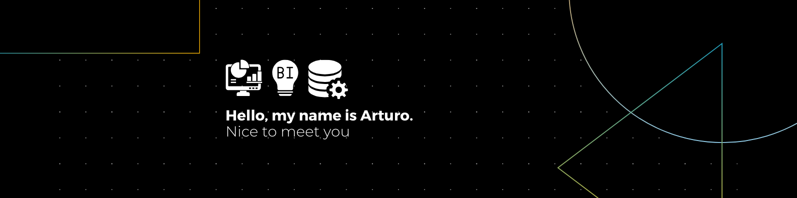

<!-- Banner: reemplaza 'assets/banner.png' por la ruta real de tu banner en el repo -->

  

# Hola — Soy Arturo López 👋
> Data Scientist Jr. | Analista de Datos con experiencia en visualización, limpieza y modelado para toma de decisiones.

<!-- Badges principales -->

  <!-- Tech / Data -->
  
  
  
  
  
  
  
  
  <!-- ML -->
  
  
  <!-- Dev -->
  
  

---

### Sobre mí
Soy **Analista de Datos / Data Scientist Jr.** con experiencia en proyectos de análisis exploratorio, limpieza de datos, visualización y modelos supervisados. Trabajo con datasets reales para extraer insights accionables que ayuden a la toma de decisiones.

### Experiencia y logros
- Análisis de ventas y KPIs en proyectos de retail (limpieza,  ETL con Python y consultas en BigQuery).
- Dashboards interactivos en Power BI para reporting semanal y mensual.
- Implementación de pipelines reproducibles con notebooks y control de versiones en GitHub.
- Mejora de procesos: reducción de tiempo en preparación de datos mediante scripts automáticos (ej.: pandas + SQL).

### Actualmente trabajando en
- Proyecto personal: **Modelado de churn** para clientes corporativos (data cleaning, feature engineering y modelo baseline con scikit-learn).
- Portafolio: subir notebooks y reportes en repositorios separados con `notebooks/`, `data/` (ejemplo reproducible).

### Certificaciones
- Certificados relevantes (añade los tuyos aquí): *Google Data Analytics*, *Coursera - Data Science*, *Power BI*.

### Contacto

  
  

